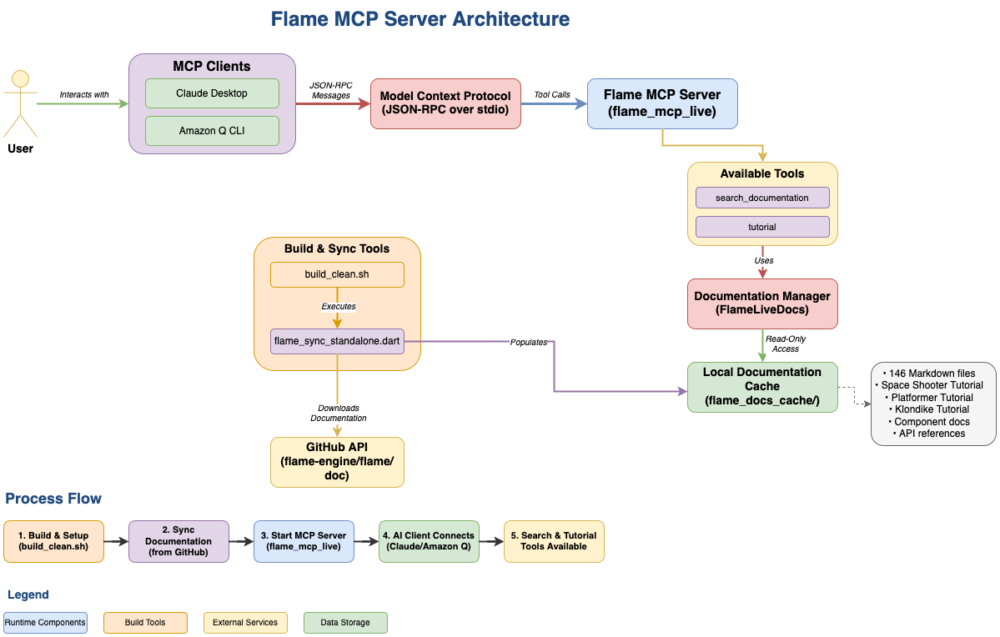

# Flame MCP Server

A Model Context Protocol (MCP) server that provides live, up-to-date documentation for the Flame game engine. This server automatically syncs documentation from the official Flame GitHub repository and serves it through the MCP protocol for use with AI assistants like Claude.

## 🎯 What This Does

- **Fetches Live Documentation**: Automatically downloads the latest Flame engine documentation from GitHub
- **Smart Caching**: Only re-syncs when documentation is older than 24 hours
- **Nightly Updates**: Optional automatic sync at 2 AM to keep docs fresh
- **Search Capability**: Search through all Flame documentation via MCP tools
- **Zero Configuration**: Works out of the box with sensible defaults

## 🏗️ Architecture



The diagram above shows both local and hosted deployment options, with complete data flow from the Flame GitHub repository to end users.

## 📋 Prerequisites

- **Dart SDK**: Version 3.2.0 or higher
- **Internet Connection**: Required for syncing documentation from GitHub
- **MCP Client**: Amazon Q Developer, or another MCP-compatible client

## 🚀 Installation & Setup

### Step 1: Clone and Build

```bash
# Clone or download this repository
cd /path/to/flame_mcp_server

# Install dependencies and build executables
./build_clean.sh
```

This will create two executables in the `build/` directory:
- `flame_mcp_live` - The main MCP server with live documentation
- `flame_sync` - Utility for manual documentation sync

### Step 2: Test the Installation

```bash
# Test manual sync (downloads ~84 documentation files)
./build/flame_sync

# Check that documentation was downloaded
ls flame_docs_cache/
```

You should see directories like `components/`, `rendering/`, `bridge_packages/`, etc.

### Step 3: Test the MCP Server

```bash
# Start the server (will auto-sync if cache is old)
./build/flame_mcp_live

# Or start with nightly scheduler enabled
./build/flame_mcp_live --scheduler
```

The server will output JSON-RPC messages. Press Ctrl+C to stop.

## 🔧 Adding as MCP Service

### Option 1: Hosted Service (Recommended)

Use the hosted version deployed on GitHub Pages - no local installation required!

```json
{
  "mcpServers": {
    "flame-docs": {
      "command": "npx",
      "args": ["-y", "@modelcontextprotocol/server-fetch", "https://yourusername.github.io/flame_mcp_server/"]
    }
  }
}
```

**Benefits:**
- ✅ No local setup required
- ✅ Always up-to-date documentation
- ✅ Automatic daily sync at 2 AM UTC
- ✅ No resource usage on your machine

### Option 2: Local Installation

For local development or custom setups:

### Option 2: Local Installation

For local development or custom setups:

#### For Claude Desktop

1. **Locate your Claude Desktop config file:**
   - **macOS**: `~/Library/Application Support/Claude/claude_desktop_config.json`
   - **Windows**: `%APPDATA%\Claude\claude_desktop_config.json`
   - **Linux**: `~/.config/Claude/claude_desktop_config.json`

2. **Add the Flame MCP server to your config:**

```json
{
  "mcpServers": {
    "flame-docs": {
      "command": "/Users/msalihg/Desktop/flame_mcp_server/build/flame_mcp_live",
      "args": ["--scheduler"]
    }
  }
}
```

**Important**: Replace `/Users/msalihg/Desktop/flame_mcp_server` with your actual path to this project.

3. **Restart Claude Desktop** - The Flame documentation will now be available in your conversations.

#### For Other MCP Clients

Add to your MCP configuration file (usually `mcp.json`):

```json
{
  "servers": {
    "flame-docs": {
      "command": "/path/to/flame_mcp_server/build/flame_mcp_live",
      "args": ["--scheduler"],
      "description": "Live Flame game engine documentation"
    }
  }
}
```

## 🌐 Deployment (GitHub Pages)

Want to host your own version? Deploy to GitHub Pages for free:

### Quick Deploy

1. **Fork or clone this repository**
2. **Push to your GitHub repository**
3. **Enable GitHub Pages** in repository settings (Source: GitHub Actions)
4. **Wait for deployment** (~3 minutes)
5. **Share your URL**: `https://yourusername.github.io/flame_mcp_server/`

### Automatic Features

- 📅 **Daily sync at 2 AM UTC** - Always fresh documentation
- 🔄 **Auto-deploy on push** - Updates when you make changes  
- 🔍 **Search functionality** - Full-text search through all docs
- 📊 **Usage statistics** - Monitor via GitHub insights

See [DEPLOYMENT.md](DEPLOYMENT.md) for detailed instructions.

## ⚙️ Configuration Options

### Server Modes

| Command | Description |
|---------|-------------|
| `./build/flame_mcp_live` | Basic mode - syncs only when cache is >24h old |
| `./build/flame_mcp_live --scheduler` | **Recommended** - includes nightly sync at 2 AM |

### Environment Variables

| Variable | Description | Default |
|----------|-------------|---------|
| `GITHUB_TOKEN` | GitHub personal access token for higher API rate limits | None |

**Setting up GitHub Token (Optional but Recommended):**

1. Go to GitHub Settings → Developer settings → Personal access tokens
2. Generate a token with `public_repo` access
3. Set the environment variable:
   ```bash
   export GITHUB_TOKEN=your_token_here
   ```

This increases your GitHub API rate limit from 60 to 5000 requests per hour.

## 🛠️ Available MCP Tools

Once connected, you'll have access to these tools in your MCP client:

### 1. `search_documentation`
Search through all Flame documentation.

**Parameters:**
- `query` (required): What to search for
- `section` (optional): Limit search to specific section

**Example usage in Claude:**
> "Search the Flame documentation for collision detection examples"

### 2. `sync_documentation`
Manually trigger a documentation sync from GitHub.

**Example usage in Claude:**
> "Sync the Flame documentation to get the latest updates"

### 3. `scheduler_status` (if using `--scheduler`)
Check the status of the nightly sync scheduler.

**Example usage in Claude:**
> "What's the status of the Flame documentation scheduler?"

## 📊 MCP Resources

The server provides access to 80+ documentation resources, including:

- `flame://getting_started` - Getting started guide
- `flame://components/component_system` - Component system documentation
- `flame://rendering/rendering` - Rendering and graphics
- `flame://inputs/inputs` - Input handling
- `flame://collision_detection/collision_detection` - Collision systems
- `flame://effects/effects` - Effects and animations
- And many more...

## 🔍 How It Works

### Documentation Sync Process

1. **GitHub API**: Fetches the directory structure from `flame-engine/flame/doc`
2. **Download**: Downloads all `.md` files while preserving directory structure
3. **Cache**: Stores files locally in `flame_docs_cache/`
4. **Metadata**: Creates sync metadata with timestamps
5. **Serve**: Makes documentation available via MCP protocol

### Smart Caching

- Checks if cached docs are less than 24 hours old
- Only syncs if cache is stale or missing
- Handles network failures gracefully
- Falls back to existing cache if sync fails

### Nightly Scheduler (Optional)

- Runs at 2:00 AM local time when enabled with `--scheduler`
- Automatically retries on failure
- Provides status information via MCP tools
- Logs sync results for debugging

## 📁 Project Structure

```
flame_mcp_server/
├── bin/
│   ├── flame_mcp_live.dart    # Main MCP server
│   └── flame_sync.dart        # Manual sync utility
├── lib/src/
│   ├── flame_live_docs.dart   # GitHub documentation fetcher
│   ├── simple_scheduler.dart  # Nightly sync scheduler
│   └── flame_mcp_live.dart    # MCP server implementation
├── build_clean.sh             # Build script
├── .gitignore                 # Git ignore rules
├── LICENSE                    # MIT License
└── README.md                  # This file

# Generated at runtime (ignored by git):
├── flame_docs_cache/          # Downloaded documentation
├── build/                     # Compiled executables
└── .dart_tool/               # Dart build artifacts
```

## 🐛 Troubleshooting

### Build Issues

**Problem**: `dart pub get` fails
**Solution**: Ensure you have Dart SDK 3.2.0+ installed

**Problem**: Permission denied when running executables
**Solution**: 
```bash
chmod +x build/flame_mcp_live build/flame_sync
```

### Sync Issues

**Problem**: GitHub rate limit exceeded
**Solution**: Set up a `GITHUB_TOKEN` environment variable

**Problem**: Network timeout during sync
**Solution**: The server will retry automatically, or run `./build/flame_sync` manually

### MCP Integration Issues

**Problem**: Claude Desktop doesn't see the server
**Solution**: 
1. Check that the path in your config is absolute and correct
2. Restart Claude Desktop after config changes
3. Verify the executable exists and is runnable

**Problem**: Server starts but no documentation appears
**Solution**: 
1. Run `./build/flame_sync` to manually sync documentation
2. Check that `flame_docs_cache/` directory contains `.md` files

## 📈 Performance & Statistics

- **Documentation Files**: ~84 Markdown files
- **Sync Time**: 30-60 seconds (depending on network)
- **Cache Size**: ~2-3 MB
- **Memory Usage**: <50 MB when running
- **Startup Time**: <1 second with valid cache

## 🤝 Contributing

1. Fork the repository
2. Create a feature branch (`git checkout -b feature/amazing-feature`)
3. Make your changes
4. Test thoroughly
5. Commit your changes (`git commit -m 'Add amazing feature'`)
6. Push to the branch (`git push origin feature/amazing-feature`)
7. Open a Pull Request

## 📄 License

This project is licensed under the MIT License - see the [LICENSE](LICENSE) file for details.

## 🔗 Related Links

- [Flame Engine Documentation](https://docs.flame-engine.org/)
- [Model Context Protocol Specification](https://modelcontextprotocol.io/)
- [Claude Desktop](https://claude.ai/desktop)
- [Dart Language](https://dart.dev/)

## 💡 Tips for Best Experience

1. **Use the scheduler**: Add `--scheduler` for automatic nightly updates
2. **Set GitHub token**: Avoid rate limiting with a personal access token  
3. **Regular syncing**: Run `./build/flame_sync` after major Flame releases
4. **Search effectively**: Use specific terms when searching documentation
5. **Check status**: Use the `scheduler_status` tool to monitor sync health

---

**Ready to get started?** Run `./build_clean.sh` and add the server to your MCP client configuration!
